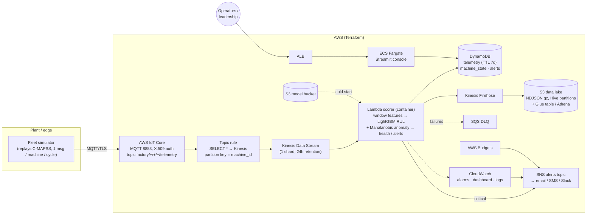

# Architecture

## Context

A plant runs a fleet of rotating assets (modelled here with NASA's C-MAPSS turbofan degradation
data). Each asset streams ~24 sensor channels once per operating cycle. Leadership wants:

1. **early warning** of failures so unplanned downtime becomes planned maintenance,
2. a **live view** of fleet health that maintenance and operations share (a lightweight digital twin),
3. a **business case** that quantifies the value.

## System view



## Data flow

| Step | Component | Notes |
| --- | --- | --- |
| 1 | **Simulator** (Fargate or laptop) | Replays `train_FD001` units as a fleet of `GT-xxx` machines. Each tick publishes one cycle per machine. A failed unit is "overhauled" (cycle restarts at 1 with a fresh unit) so the fleet runs forever with a mix of young and ageing assets. |
| 2 | **IoT Core** | Device identity = X.509 cert generated by Terraform; policy allows `iot:Connect` for one client id and `iot:Publish` under `factory/*` only. |
| 3 | **Topic rule → Kinesis** | `partition_key = ${machine_id}` keeps per-machine ordering inside a shard, which the rolling-window features depend on. |
| 4 | **Lambda scorer** | Event source mapping, batch ≤200 / 5 s window, bisect-on-error, 3 retries, DLQ. Per machine it fetches the last *W−1* readings from DynamoDB, rebuilds the window, computes features, predicts, assesses health, de-duplicates alerts (transition-based, with hysteresis and EWMA-smoothed anomaly score), writes everything back. |
| 5 | **DynamoDB** | `telemetry` (PK machine_id, SK ts, TTL) is the hot time-series. `machine_state` is the digital-twin snapshot (one row per asset). `alerts` + GSI `status-ts-index` powers the alert inbox. |
| 6 | **Firehose → S3 → Athena** | Every scored record is archived as NDJSON (gzip) under `telemetry/year=/month=/day=/`. A Glue table with partition projection makes it queryable immediately for model monitoring and retraining. |
| 7 | **SNS** | Critical alerts (and platform alarms, budget alerts) fan out to subscribers. |
| 8 | **Dashboard** | Streamlit on Fargate behind an ALB. Reads DynamoDB only (plus the model bundle for the model card). Fragments auto-refresh every 5 s. Optional shared access code; production should put Cognito on the ALB. |

## Why these choices

* **IoT Core + Kinesis + Lambda** is the canonical serverless IoT ingestion path on AWS: no brokers or consumers to patch, scales by shard, and the Lambda container image can carry LightGBM without Lambda layer size games.
* **DynamoDB instead of Timestream.** Amazon Timestream for LiveAnalytics stopped accepting new customers on 2025‑06‑20; its successor, Timestream for InfluxDB, is an EC2-class instance in a VPC (≈ $80+/month, plus NAT or endpoints for Lambda). The dashboard's access patterns — latest *N* points per machine, current state of every machine, open alerts — are key-value lookups that DynamoDB serves in single-digit ms with zero idle cost. Long-horizon analytics belong in the S3 data lake anyway.
* **Stateless compute, stateful features.** The Lambda is stateless; the rolling window is rebuilt from DynamoDB on each batch (one `Query` per machine per batch). This survives redeploys and shard re-balancing without a stream-processing framework.
* **Identical feature code online and offline.** `pdm.features.window_features` is used both by `ml/train.py` and by the Lambda — tested for equality — so there is no training/serving skew.
* **Conformal intervals rather than quantile boosting.** LightGBM quantile objectives degenerate on the capped RUL target (>50 % of rows sit at the cap, so the 90th-percentile residual in every leaf is 0). Split conformal intervals are calibrated by construction and cost nothing at inference.
* **Alert hygiene is a product feature.** Transition-based alerts + hysteresis + EWMA + burn-in reduced alert volume ~5× on the demo fleet while keeping every late-life escalation. Operators abandon noisy systems.
* **No NAT gateway.** Fargate tasks sit in public subnets with public IPs and reach AWS APIs over TLS. For production: private subnets, VPC endpoints, Cognito on the ALB, WAF.

## Cost at demo scale (ap-northeast-1, 10 machines, 1 cycle / 5 s)

| Item | Approx. monthly |
| --- | --- |
| Kinesis 1 shard | $13 |
| Lambda (≈ 500k invocations, 1 GB, ~300 ms) | $3 |
| DynamoDB (≈ 5.5M writes, reads from dashboard) | $8 |
| Firehose + S3 + Athena | < $2 |
| ALB | $20 |
| Fargate dashboard (0.5 vCPU / 1 GB) + simulator (0.25 / 0.5) | $25 |
| IoT Core (≈ 5M messages) | $5 |
| **Total** | **≈ $75** — set `simulator_desired_count = 0` when not demoing (→ ≈ $45) |

A Budgets alarm at `monthly_budget_usd` (default $100) emails you before it gets out of hand.

## Security notes

* Device auth is mutual TLS with a per-gateway certificate; the policy is scoped to one client id and the `factory/*` topic namespace.
* Private key and certificate live in SSM SecureString; the Fargate execution role can read exactly those two parameters.
* All buckets block public access and are SSE-encrypted; DynamoDB tables are encrypted; Kinesis uses the AWS-managed KMS key.
* IAM is least-privilege per role (IoT rule, Firehose, scorer, ECS execution, dashboard task, simulator task).
* The dashboard SG only accepts traffic from the ALB SG; the ALB accepts traffic from `dashboard_allowed_cidrs`.

## Repository map

```
src/pdm/              shared library (schema, features, model, health rules, storage adapters, simulator, scorer)
ml/train.py           training + evaluation -> artifacts/model
services/scorer/      Lambda handler + Dockerfile
services/simulator/   MQTT publisher + Dockerfile
services/dashboard/   Streamlit console (+ views, charts) + Dockerfile
infra/terraform/      all AWS resources
scripts/              demo runner, build & push, cert fetch, smoke test
tests/                unit, pipeline (SQLite + moto DynamoDB/Firehose/SNS), Lambda handler, dashboard render tests
docs/                 this file, business case, model card, runbook
```
